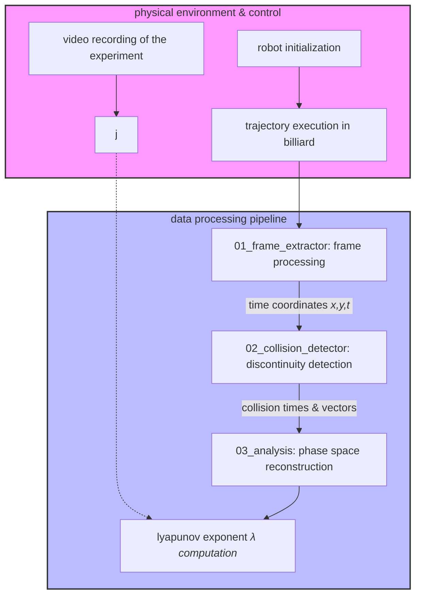

# Robot Billiard - Master's Research Project

This repository contains the modeling files, schematics, embedded robot control code, and processing pipeline for the chaotic lemon billiard experiment.

## Repository Structure

```text
.
├── docs/
│   ├── manuals/               # Robot manuals and technical specifications
│   └── circuit/               # Electronic schematics and diagrams
├── hardware/
│   └── 3d_printing/           # 3D modeling files (.stl) and slicing parameters
├── robot_software/            # Embedded robot control source code
└── data_pipeline/
    ├── 01_frame_extractor/    # Image processing: Video (Frames) -> Coordinates
    ├── 02_collision_detector/ # Data processing: Trajectories -> Collisions
    └── 03_analysis/           # Nonlinear dynamics: Phase Space & Lyapunov Exponents
```

## Scientific Data Flow

1. **Acquisition**: The robot executes the physical experiment under the control of the firmware located in `robot_software/`.
2. **Extraction**: The `data_pipeline/01_frame_extractor/` module performs planar tracking on video frames, converting visual markers into time-series coordinates.
3. **Detection**: The `data_pipeline/02_collision_detector/` module processes velocity discontinuities in coordinates to locate exact collision times and vectors.
4. **Dynamics Analysis**: The `data_pipeline/03_analysis/` module uses collision states to reconstruct the phase space (Poincaré map) and compute the Lyapunov exponent, quantifying chaotic divergence.

### Experimental Flowchart


