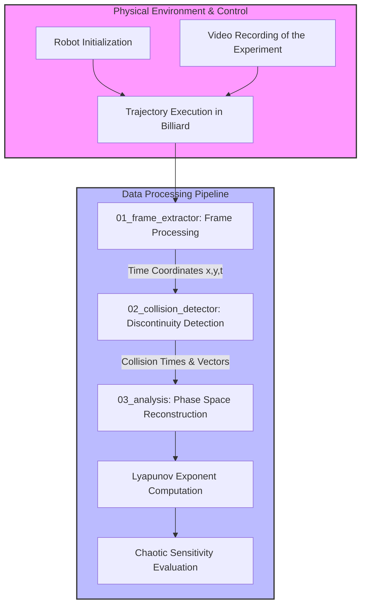

# Experimental Flowchart

This document presents the operational sequence and data flow of the Lemon Billiard experiment.

```mermaid
flowchart TD
    subgraph PhysicalExperiment [Physical Environment & Control]
        A[Robot Initialization] --> B[Trajectory Execution in Billiard]
        C[Video Recording of the Experiment] --> B
    end

    subgraph SoftwarePipeline [Data Processing Pipeline]
        B --> D[01_frame_extractor: Frame Processing]
        D -->|Time Coordinates x,y,t| E[02_collision_detector: Discontinuity Detection]
        E -->|Collision Times & Vectors| F[03_analysis: Phase Space Reconstruction]
        F --> G[Lyapunov Exponent Computation]
        G --> H[Chaotic Sensitivity Evaluation]
    end

    style PhysicalExperiment fill:#f9f,stroke:#333,stroke-width:2px
    style SoftwarePipeline fill:#bbf,stroke:#333,stroke-width:2px
```
