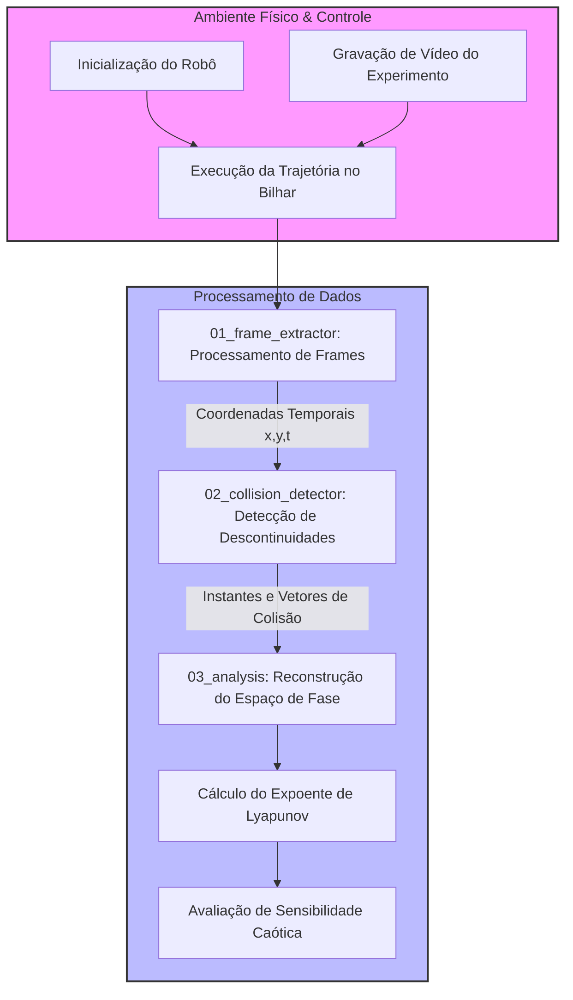

# Fluxograma do Experimento

Este documento apresenta a sequência operacional e o fluxo de dados do experimento do Lemon Billiard.

```mermaid
flowchart TD
    subgraph ExperimentoFisico [Ambiente Físico & Controle]
        A[Inicialização do Robô] --> B[Execução da Trajetória no Bilhar]
        C[Gravação de Vídeo do Experimento] --> B
    end

    subgraph PipelineSoftware [Processamento de Dados]
        B --> D[01_frame_extractor: Processamento de Frames]
        D -->|Coordenadas Temporais x,y,t| E[02_collision_detector: Detecção de Descontinuidades]
        E -->|Instantes e Vetores de Colisão| F[03_analysis: Reconstrução do Espaço de Fase]
        F --> G[Cálculo do Expoente de Lyapunov]
        G --> H[Avaliação de Sensibilidade Caótica]
    end

    style ExperimentoFisico fill:#f9f,stroke:#333,stroke-width:2px
    style PipelineSoftware fill:#bbf,stroke:#333,stroke-width:2px
```
